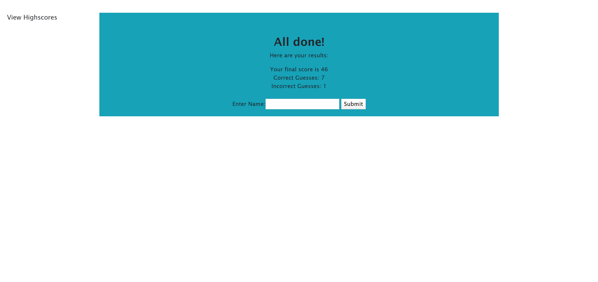
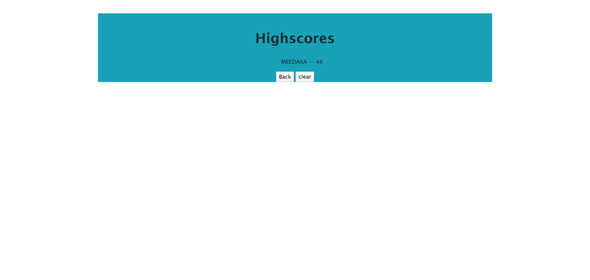
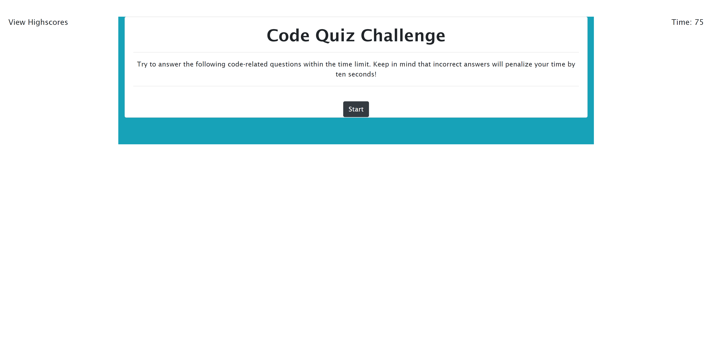
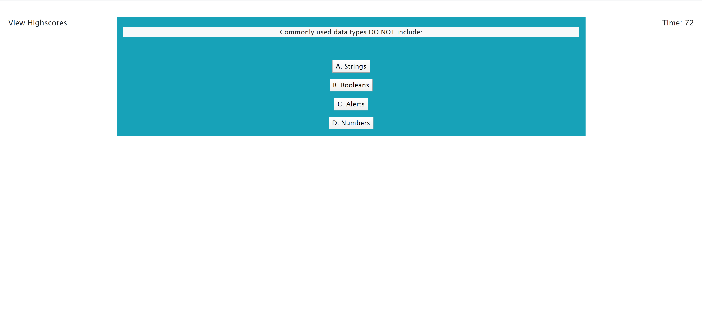

# Assignment-week-4

## How to Use Application:
The application is a quiz to test your general coding knowledge. you start the quiz by pressing by clicking the start button. Once you have clicked start a timer will begin counting down. You have 75 seconds to complete the quiz. once complete or if the timer reaches 0, the final page will be shown where the results of your quiz will be presented. On that same page is a form to write your name so that you can save your score to the highscore page. once you have typed your name and click submit you will be redirected to the highscore page where you will see your name and your score printed. The highscore page has a clear button to clear all highscore entries and a back button if you want to retake the quiz. 10 seconds is deducted for every wrong answer. The quicker you complete the quiz the higher your score

I wrote the code on a single HTML page and used JS and Jquery to hide and show necessary parts of the HTML code. I used the bootstrap framework for much of the css but I added a bit of css myself.

### Links:

__github repository link__
https://github.com/meeday/Assignment-week-4

__Deployed Application Link__
https://meeday.github.io/Assignment-week-4/

__IMAGES__

